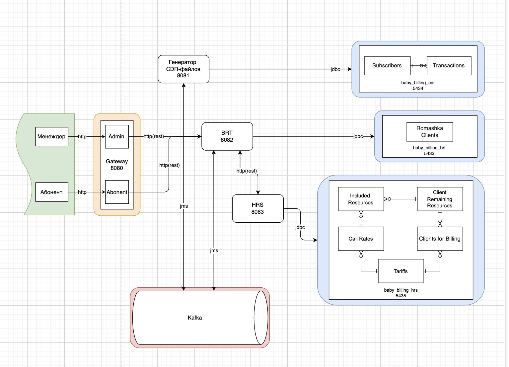

# Baby Billing Service

Сервис, эмулирующий работу биллинговой системы.

| Инструменты |
| ------ |
| OpenJDK 17 |
| Maven |
| Spring + Spring Boot |
| Spring Cloud |
| Feign |
| Liquibase |
| Kafka |
| Docker |
| PostgreSQL |
| Swagger |
| Junit5 |

## Запуск проекта через docker:
Перед запуском убедиться, что установлен docker-compose.

```cmd
docker-compose -f docker-compose.prod.yml up -d
```

## Структура проекта



Была разработана микросервисная архитектура с такими модулями:
- [CDR service](./main/cdr-generator-service) - сервис генерирующий cdr файлы. Они создаются:
  - случайным образом;
  - параллельно;
  - в хронологическом порядке.
- [BRT service](./main/brt-service) - сервис, получающий файлы cdr и обрабатывающий их. Сначала происходит авторизация абонента, затем посылается запрос в hrs сервис для расчета абонента. После получении ответа от hrs происходит списание денег со счета.
- [HRS service](./main/hrs-service) - сервис, производящий расчет абонентов в зависимости от их тарифного плана.
- [Gateway](./main/gateway) - API сервис для абонентов и менджеров. Сначала производятся аутентификация и авторизация пользователя по логину и паролю через basic auth, затем происходит обработка запроса.
- [Eureka server](./main/eureka-server) - discovery сервер для удобного общения между микросервисами.

## Ссылки

- [Презентация](https://docs.google.com/presentation/d/1JDAMButGdhOddntR-gk3Lp8oG1QH8wtAppYIHtdBuk0/edit?usp=sharing)

- [Описание и схемы работы](https://docs.google.com/document/d/1y5WzJZcpKMCYVbWdlhkGHp-PvMB6De8SrtQ2FCxkeio/edit#heading=h.xwdzw0l1f221).

- [Swagger](http://localhost:8080/swagger-ui/index.html)

- [Тест-план](https://docs.google.com/document/d/10_4xf1Bk2PrUTof9l3HXOfeX7tGJ-P8MTxtWmvgV_e0/edit?usp=sharing)

- [Отчет по тестированию](https://docs.google.com/document/d/1cuTb9BIMtL9SvBQ4PKpHP1oQkwaLvPYPQPUyZ5Chs1w/edit?usp=sharing)
  
  Для входа менеджеру:
   - логин: admin 
   - пароль: admin
  
  Для входа абоненту, например:
   - логин: +79000000010
   - пароль пустой

- Базы данных: 
  - brt: localhost:5433/baby_billing_brt
  - cdr: localhost:5434/baby_billing_cdr
  - hrs: localhost:5435/baby_billing_hrs
  
  user: admin
  
  password: admin


## Запуск проекта локально:
Перед запуском убедиться, что установлен maven, jdk17, работающий broker kafka, а также существуют базы данных и юзеры, описанные в application.yml сервисов.

Для удобной и быстрой работы с kafka и базой данных можно их запустить в докере из папки [docker-dev](./docker-dev):
```cmd
docker-compose -f docker-compose.dev.yml up -d
```

Сборка проекта:
```cmd
cd ./main
mvn clean install
```

Далее в разных терминалах из папки [main](./main/)
Запуск eureka discovery server:
```cmd
cd ./eureka-server
java -jar .\target\eureka-server-0.0.1.jar
```

Запуск генератора cdr:
```cmd
cd ./cdr-generator-service
java -jar .\target\cdr-generator-service-0.0.1.jar
```

Запуск hrs-service:
```cmd
cd ./hrs-service
java -jar .\target\hrs-service-0.0.1.jar
```

Запуск gateway api:
```cmd
cd ./gateway
java -jar .\target\gateway-0.0.1.jar
```

Потом лучше убедиться, что работает hrs сервис и только после этого запустить brt-service:
```cmd
cd ./brt-service
java -jar .\target\brt-service-0.0.1.jar
```

## Нюансы принятых решений:

Brt сервис лучше запускать после запуска hrs, чтобы синхронизировать пользователей в базе данных. Так как информация о пользователях хранится в brt, а hrs необходимо следить за минутами в ежемесячных тарифах, необходима привязка к абонентам в hrs. Но была добавлена функция, которая, пока не синхронизирует данные с hrs, не запустит работу всего сервиса brt.

В проекте также есть обычный docker-compose.yml для создания образов и загрузки их в Docker Hub.
Чтобы это сделать, надо сначала убедиться, что maven и docker установлены, а потом:
```cmd
cd ./main
mvn clean install
docker-compose build
docker login
docker-compose push
```
